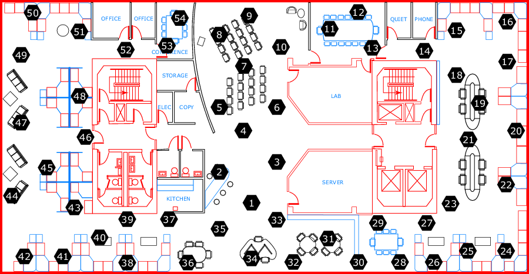

# Um tratamento para outliers e dados ausentes em séries temporais multivariadas em Redes de Sensores Sem Fio

### Contexto da Aplicação
SMA - FUZZY
> Acesse o post em: https://medium.com/@crislanio.ufc/um-tratamento-para-outliers-e-dados-ausentes-em-s%C3%A9ries-temporais-multivariadas-em-redes-de-7e2a83878e69

| Aplicação                     | Versão        |
| :---------------------------- |:-------------:|
| SMA-FUZZY                 | 1.0.0           |

- Projeto feito usando o jupyter  utilizando python 3.4;

## Dependências
- python 3.4
- jupyter notebook

## Resumo
Séries temporais multivariadas, tais como aquelas obtidas em RSSF densas, frequentemente exibem correlações espacial e temporal nos dados. Esta propriedade pode ser utilizada para tratar e minorar os efeitos de dois eventos frequentes em processos de aquisição de dados: a presença de outliers e a ausência de dados. Este trabalho apresenta e avalia uma estratégia conjunta baseada em regressão não paramétrica para tratar outliers e dados faltantes. Outliers são detectados por técnicas estatísticas e tratados como dados faltantes. A Inferência Fuzzy (FI) é usada para estimar as temperaturas dos sensores e a decomposição dos dados das séries temporais é realizada pelo Método de Média Móvel Simples (SMA).

## Como rodar
 - Em cada sensor acesso o arquivo outliers_SMA.ipynb e execute as celular uma a uma; depois de gerar o arquivo imputation.csv acesse o arquivo sSensorAtual_sVizinho1_sVizinho2-FI.ipynb e gere o arquivo sensorfinal.csv
 - Com o arquivo sensorfinal.csv gere as estatísticas básicas dos sensores no arquivo  outliers_SMA.ipynb
 
 ## Referências
 - Cateni, S., Colla, V., and Vannucci, M. (2007).  A fuzzy logic-based method for outliersdetection. InArtificial Intelligence and Applications, pages 605–610.
 - Chandola, V., Banerjee, A., and Kumar, V. (2009).  Anomaly detection:  A survey.ACMcomputing surveys (CSUR), 41(3):15.
 - Cho, H.-Y. and Oh, J.-H. (2012). Outlier detection of the coastal water temperature moni-toring data using the approximate and detail components.Journal of the Korean Societyfor Marine Environment & Energy, 15(2):156–162.
 - Cho, H. Y., Oh, J. H., Kim, K. O., and Shim, J. S. (2013).  Outlier detection and missingdata filling methods for coastal water temperature data.Journal of Coastal Research,65(sp2):1898–1903.
 - Gil, P., Martins, H., and Janu ́ario, F. (2018). Outliers detection methods in wireless sensornetworks.Artificial Intelligence Review, pages 1–26.
 - Jang, J.-S. R., Sun, C.-T., and Mizutani, E. (1997).  Neuro-fuzzy and soft computing; acomputational approach to learning and machine intelligence.
 - Tan, Y. L., Sehgal, V., and Shahri, H. H. (2005). Sensoclean: Handling noisy and incom-plete data in sensor networks using modeling.Main, pages 1–18.
 - Teng, H. S., Chen, K., and Lu, S. C. (1990).  Adaptive real-time anomaly detection usinginductively generated sequential patterns.  InResearch in Security and Privacy, 1990.Proceedings., 1990 IEEE Computer Society Symposium on, pages 278–284. IEEE.
 - Zhang,  Y.,  Meratnia,  N.,  and  Havinga,  P.  J.  (2010).   Outlier  detection  techniques  forwireless sensor networks:  A survey.IEEE Communications Surveys and Tutorials,12(2):159–170
